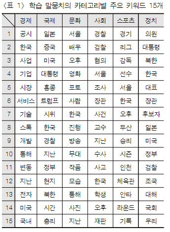
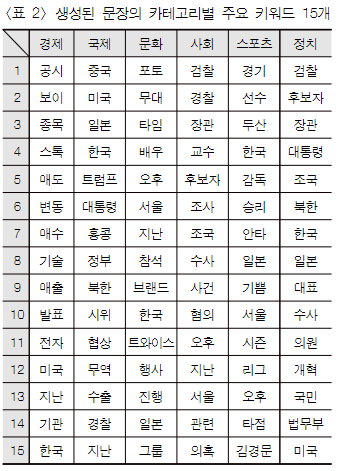
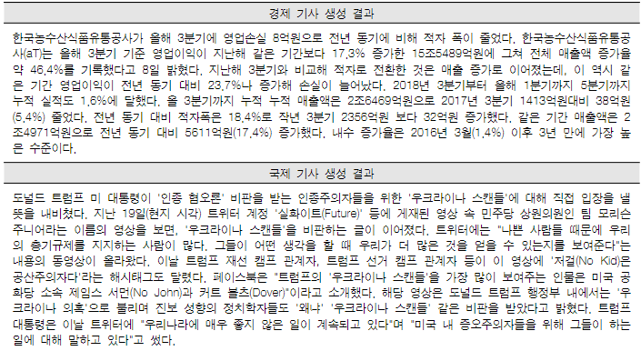
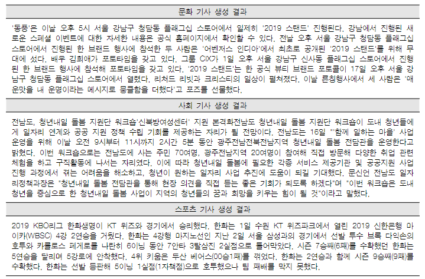

# **딥러닝 기반의 한글 문장 생성 기법**
### 손성환 | 로앤컴퍼니
### 강승식 | 국민대학교
 
 2023468101 최강훈

---
# **목차**
## 1. 자연어 생성 모델의 역사
## 2. GPT-2 기반의 문장 생성 기법
## 3. GPT-2를 이용한 실험
## 4. 결론
---
<!-- _header: 자연어 생성 모델의 역사 -->
# 통계적 언어 모델 (Statistical Language Model, SLM)
- 토큰의 순서 정보에 따른 확률 분포.
- 조건부 확률의 연쇄 법칙을 이용한 다음 단어의 출현 확률을 기반으로 생성.

---
<!-- _header: 자연어 생성 모델의 역사 -->
# 조건부 확률의 연쇄 법칙
## 두 확률 P(A), P(B)에 대하여
- ### P(B|A) = P(A,B) / P(A)
- ### P(A,B) = P(A)P(B|A)
- ### P(x1,x2,x3,...,xn) = P(x1)P(x2|x1)P(x3|x1,x2)...P(xn|x1,...,xn-1)

---
<!-- _header: 자연어 생성 모델의 역사 -->
## 카운트 기반의 접근
- 훈련 데이터에서 각 단어의 출현 빈도를 카운트
- P(is|An adorable little boy) = count(An adorable little boy is) / count(An adorable little boy)
## 희소성 문제 (Sparcity Problem)
- 훈련 데이터 중 'An adorable little boy is' 단어 시퀀스가 없다면 확률은 0이 됨.
- 'is'는 문법적으로 적합하고 충분히 사용할 수 있는 단어.

---
# N-gram 언어 모델
- 이전 단어 전체를 카운트하는 대신 N개의 단어만을 고려해서 확률을 산출.
- P(is|An adorable little boy) ≈ P(is|boy) (unigram, 1-gram)
## 한계점
- 희소성 문제의 완전 해결은 근본적으로 불가.
- 정확도와 모델 크기간의 Trade-off

---
<!-- _header: 자연어 생성 모델의 역사 -->
# 딥러닝 기법의 도입
## LSTM (Long Short-Term Memory)
- 장/단기 기억을 가능하계 설계한 신경망의 구조.

### LSTM의 구성 요소
- 셀 상태 (Cell State) : 과거 데이터의 정보를 유지하는 장기 메모리
- 입력 게이트 (Input Gate) : 입력된 정보를 얼마나 Cell State에 반영할지 결정
- 삭제 게이트 (Forget Gate) : 이전 정보를 얼마나 Cell State에 반영할지 결정
- 출력 게이트 (Output Gate) : Cell State의 정보를 얼마나 다음 노드에 전달할지 결정

---
<!-- _header: 자연어 생성 모델의 역사 -->
### LSTM의 구조

---
<!-- _header: 자연어 생성 모델의 역사 -->
## Seq2Seq (Sequence-to-Sequence)

- 두개의 RNN을 각각 Encoder와 Decoder로써 Context를 이용하여 연결하여 입출력하는 구조.

---
<!-- _header: 자연어 생성 모델의 역사 -->
### 한계
1. 고정된 크기의 벡터에 모든 정보를 압축하는 과정에서의 정보 손실.
2. 기울기 손실(Gradient Vanishing) 문제 발생 .
### Attention
- 다음 단어 출현을 예측하는 시점마다 인코더에서의 전체 입력 문장을 다시 한 번 참고함.
- 해당 시점에서 예측해야 하는 단어와 연관이 있는 단어 부분을 집중 (Attention)

---
<!-- _header: GPT-2 기반의 문장 생성 기법 -->
# GPT-2 (Generative Pre-trained Transformer 2)
- Transformer의 Decoder만을 사용한 Self-Attention 기반의 사전학습 및 전이학습 기법의 딥러닝 모델.
## 특징
1. Positional Encoding
2. Self-Attention

---
<!-- _header: GPT-2 기반의 문장 생성 기법 -->
# Positional Encoding
- 순환 신경망은 토큰을 순차적으로 입력하면서 특성을 누적시키는 방식으로 토큰의 순서 정보를 입력.
- Transformer는 Positional Encoding을 통해 토큰의 순서 정보를 입력.
  - 토큰의 위치에 따라 각기 다른 동일한 크기의 Positional Encoding 벡터를 더함.

---
<!-- _header: GPT-2 기반의 문장 생성 기법 -->
# Self-Attention
## Multi-Head Attention
- 전체 토큰을 대상으로 각 Attention Head의 관심사를 다르게 설정하여 이를 병렬로 처리.

## Masked Multi-Head Attention
- 현재 예측해야 하는 단어 이후의 단어에 대한 Attention을 제한하여 이전 단어에만 집중하도록 함.
---
<!-- _header: GPT-2를 이용한 실험 -->
# 신문기사 생성 실험
- GPT-2는 사전학습 모델로 대용량 데이터를 학습 후, Fine-Tuning을 거처 추가학습을 진행.
- 저자는 실험을 위해 신문기사 데이터 셋 (KCC150, KCCq28, KCC940)과 추가로 수집한 데이터를 이용하여 사전학습을 진행.
- KCC 데이터 셋은 문맥 정보가 고려되지 않고 데이터가 충분하지 않음.
  - '경제', '국제', '문화', '사회', '스포츠', '정치' 카테고리의 특수 토큰을 입력으로 학습을 진행.

---
<!-- _header: GPT-2를 이용한 실험 -->

---
<!-- _header: GPT-2를 이용한 실험 -->

---
<!-- _header: GPT-2를 이용한 실험 -->

---
<!-- _header: 결론 -->
# 결론
- 훈련 데이터에 맞춰 카테고리별로 생성하는 양상을 확인.
- 문장 단위 완성도와 전체 문맥 완성도가 LSTM 모델보다 더 높은 성능을 가지고 있음을 확인.
- 특정 카테고리에서의 반복되는 어구나 문장구조가 많은 경우 훈련 데이터와 중복되는 결과나 특정 어구를 반복해서 생성하는 문제가 있음.
- '정치'와 '사회' 카테고리의 경우, 학습 데이터 생성 시점에 크게 화제가 되었던 주제 위주로 생성.
---

# 감사합니다.