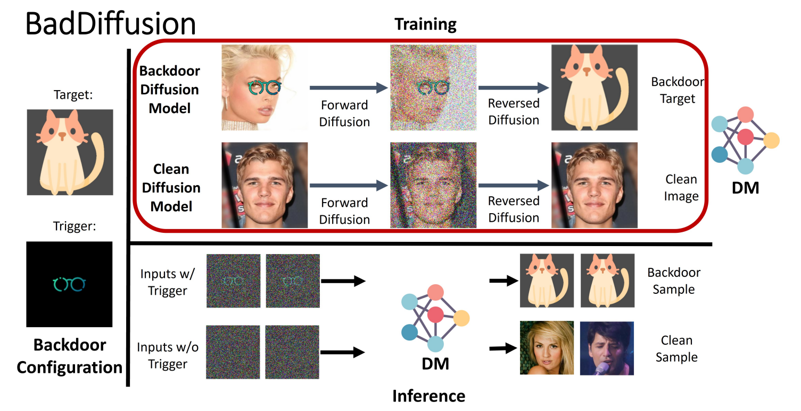

# **생성 AI 보안 및 프라이버시 이슈**
### 박대얼 • 류권상 • 최대선 | 숭실대학교
 
 2023468101 최강훈

---
# 목차
## 1. 생성 AI의 보안 이슈
## 2. 생성 AI의 보안 및 프라이버시 공격
## 3. 결론

---
## 1. 생성 AI의 보안 이슈
### 1.1 텍스트 생성 AI 모델
- ChatGPT는 여러 시험에 합격점을 받을 수 있는 능력이 있음이 입증됨.
  - Wharton MBA 시험 [1]
  - 미국 의사 면허 시험 [2]
- 시험 및 과제에 텍스트 생성 AI 모델 사용.
- DAN (Do Anything Now) 명령어를 통한 Jail-Break
  - DAN 명령어가 공유 되면서 모델에 걸어둔 제한을 해제할 수 있음.
  - https://www.jailbreakchat.com/

<!-- _footer : '[1] https://mackinstitute.wharton.upenn.edu/wp-content/uploads/2023/01/Christian-Terwiesch-Chat-GTP.pdf   [2] https://www.medrxiv.org/content/10.1101/2022.12.19.22283643v2 '-->
---

### 1.2 이미지 생성 AI 모델
- Midjourney를 이용해 생성된 이미지의 대회 수상 [3]
- 타인의 화풍을 학습한 AI 모델 [4]
<!-- _footer: '[3] https://m.khan.co.kr/economy/economy-general/article/202209100800001   [4] https://www.seoul.co.kr/news/newsView.php?id=20221010500054' -->

---
### 1.3 음성 생성 AI 모델
- AI 스피커 '알렉사'의 위험한 지시 [5]
- 대기업 임원의 목소리를 학습한 AI 모델을 이용한 보이스 피싱 [6]

<!-- _footer: '[5] https://www.bbc.com/news/technology-59810383   [6] https://www.forbes.com/sites/thomasbrewster/2021/10/14/huge-bank-fraud-uses-deep-fake-voice-tech-to-steal-millions/?sh=74f926157559' -->

---

# 2. 생성 AI의 보안 및 프라이버시 공격
## 2.1. Poisioning 공격
- AI 모델 학습 과정에 관여하여 AI 시스템 자체를 손상.
  - 데이터 셋에 올바르지 않은 데이터를 주입.
  - MS의 인공지능 채팅 봇 'Tay'
  - 스캐터랩의 인공지능 채팅 봇 '이루다'

<!-- _footer: '[6] http://m.dongascience.com/news.php?idx=11158   [7] https://m.khan.co.kr/it/it-general/article/202101112117001' -->

---

## 2.2 Backdoor 공격
- 특정 트리거를 이용해 부적절한 결과를 생성하게 함.

---

## 2.3 Model Inversion 공격
- AI 모델의 결과물을 이용해 학습에 사용된 데이터를 추출.

<!-- _footer: 'https://dl.acm.org/doi/10.1145/2810103.2813677' -->

---
## 2.4 Membership Inference 공격
- 특정 데이터가 모델의 학습 데이터로 사용되었는지 여부를 판별.

<!-- _footer: 'https://arxiv.org/abs/2301.13188' -->
---
## 2.4 Model Extraction 공격
- AI 생성 모델의 구조 및 가중치를 추출.

<!-- _footer: 'https://www.usenix.org/system/files/conference/usenixsecurity16/sec16_paper_tramer.pdf' -->

---
# 3. 결론
- 생성 AI 모델의 남용 및 범죄 수단으로써의 사용을 규제할 사회적, 법률적 규제의 확립 필요.
- 이러한 공격에 대한 방어 기술의 개발 필요.
  - 적대적 데이터를 포함하여 학습. (Adversarial Training)
  - 결과값 노출 제한 및 암호화.
  - 적대적 공격 탐지 모델.
  - 단위시간당 생성 요청 수 제한.
