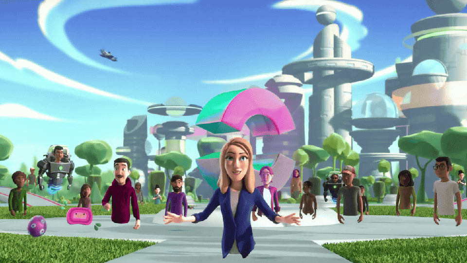
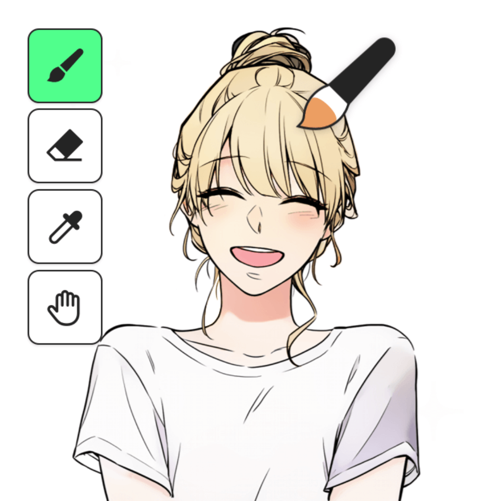

# **생성형 인공지능 미디어를 만들다**

### 박종일 • 박종열 | 서울과학기술대학교

 
 2023468101 최강훈

---

### 생성형 인공지능

> 학습데이터를 기반으로 새로운 콘텐츠, 이미지, 음악 등을 생성하는 인공지능의 한 유형

---

## 이미지 생성 모델

### GAN (Generative Adversarial Network)

- 2014년 구글의 Ian Goodfellow에 의해 제안.
- '적대적 신경 생성망'
- 생성기와 판별기
  - 생성기는 판별기가 진짜로 판별되도록 학습.
  - 반대로 판별기는 생성기가 생성한 이미지를 가짜로 판별하도록 학습.
- Progressive GAN, BigGAN, Conditional GAN, StyleGAN

---

---

### GAN의 장점

1. 실제 사진과 유사한 일관성 있는 이미지를 생성할 수 있다.
2. 모델 구조의 선택이 자유롭다.

### GAN의 단점

1. Model의 Coverage가 좁기 때문에 다양한 이미지를 생성하는데에는 한계가 있다.
2. 훈련 과정의 불안정성

---

### DDPM (Denoising Diffusion Proballistic Model)

- 이미지에 가우시안 노이즈를 순차적으로 추가하며, 완전한 Noise로 변환
- 이것의 역변환을 학습하여 이미지를 생성하는 메커니즘
  

---

### 장점

1. 훈련 목표가 고정되어있다.
2. Model의 Coverage가 넓어 다양한 이미지를 생성할 수 있다.

### 단점

1. 순차적인 Inverse Process를 따르기 때문에 생성 속도가 느리다.
2. 비사실적인 이미지가 생성될 확률이 높다.

---

# DALL·E 3

| OpenAI

---

# Stable Diffusion 3

| Stability AI

---

# Midjourney v6

| Midjourney

---

# 텍스트 생성 모델

### 1. GPT-4 / OpenAI

### 2. Gemini 1.5 / Google

### 3. LLaMa 3 / Meta

### 4. Mistral / Mistral AI

### 4. Claude 3 / Anthropic

---

# 동영상 생성 모델

## [Imagen](https://imagen.research.google/video/)
## [Stable Video](https://stability.ai/news/stable-video-diffusion-open-ai-video-model)
## [Sora](https://openai.com/index/sora/)

---

# 생성형 인공지능으로 구현되는 메타버스

### 메타버스

| 현실의 나를 대리하는 아바타를 통해 일상 활동과 경제생활을 영위하는 3D 기반의 가상세계

---

## 1. 개발 편의성

### NVIDIA GET3D

- 프롬프트를 기반으로 메쉬와 텍스쳐를 생성

### Unity Muse

- 프롬프트 입력을 통해 게임 제작에 필요한 요소 대부분을 제작 가능

---

## 2. 콘텐츠 창작

### Webtoon AI Painter

- AI를 기반으로 한 채색 서비스

### Adobe Premiere Pro

- 자동 캡션 (자막) 생성 지원

---

## 3. 상호작용

- 말하는 사람의 입모양을 3D 모델에 반영하며 현실감 증대  [HeyGen](https://www.heygen.com)

- NPC의 인공지능을 부여하여 사용자와의 사실성 있는 상호작용

---

# 결론

- 생성형 인공지능은 다양한 콘텐츠 산업에 활용될 수 있는 무궁한 가능성이 있으며, 이미 산업에 활용되는 실용화 단계에 진입함.
- 생성형 인공지능은 미래 콘텐츠 산업 중 하나인 메타버스에 중요한 역할을 할 것으로 기대됨.
- 악의적 사용, 개인정보 보호, 윤리적 문제, 데이터 편향 등의 사회적 문제를 줄이기 위해 연구자들의 윤리의식과 부작용을 방지할 수 있는 정책적 연구가 필요.