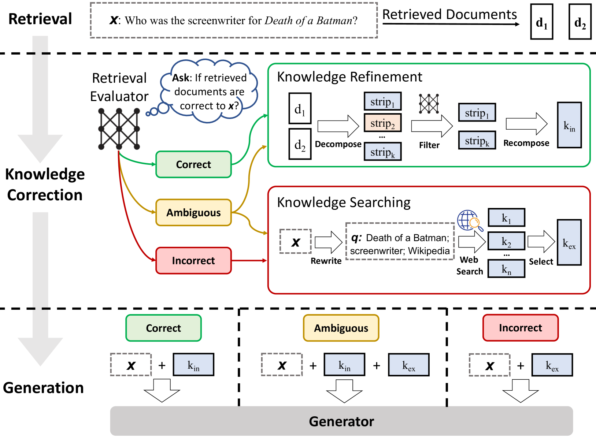
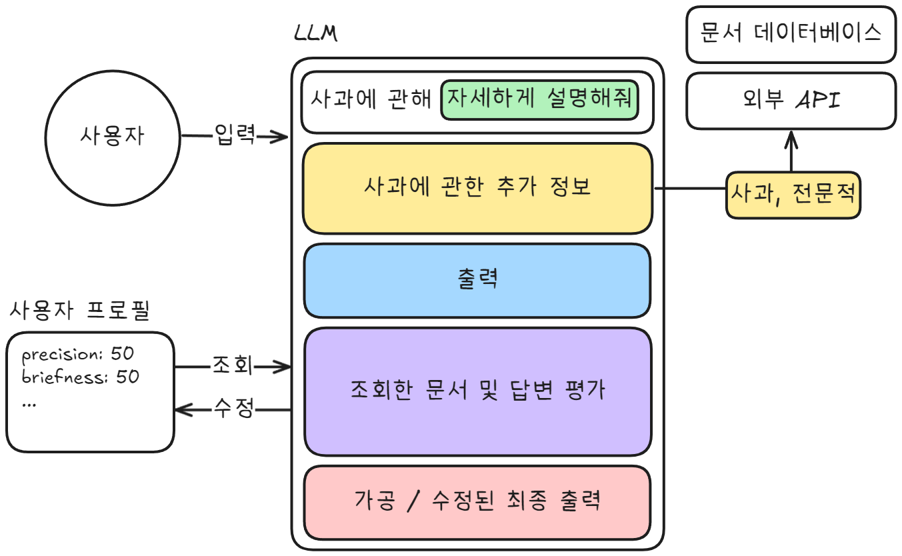

# **검색 증강 생성 시스템에서의 관련성 평가를 위한 감사 모델**

### 최강훈 | 2023468101

---

# 검색 증강 생성 (RAG, Retrieval Augmented Generation)

- 대규모 언어 모델의 한계를 보완하고 정교한 답변을 제공하기 위해 검색된 문서를 활용하는 방식
- RAG 시스템의 성능은 사용자가 입력한 쿼리와 검색된 문서 간의 관련성에 크게 의존
- 관련성 평가의 정확성을 향상하는 것은 RAG 시스템의 신뢰성과 효율성을 높이는 핵심 요소 중 하나

---

# 감사 모델 (Auditor Model)

- RAG 시스템의 문서 조회 과정에서 조회한 문서와 사용자의 입력간의 관련성을 평가하기 위한 모델

---

# TF-IDF (Term Frequency-Inverse Document Frequency)

- 단어의 빈도와 역 문서 빈도를 이용해 단어마다의 중요도를 계산하는 방법.

## 한계

- 단어의 빈도를 과대하게 평가하는 문제 존재

---

| 문서 A                                                                                                                                                                                                                                                                                                   | 문서 B                                                                          |
| -------------------------------------------------------------------------------------------------------------------------------------------------------------------------------------------------------------------------------------------------------------------------------------------------------- | ------------------------------------------------------------------------------- |
| 사과(沙果)는 사과나무의 열매로, 세계적으로 널리 재배되는 열매 가운데 하나다. 평과(苹果) 또는 빈파(頻婆)라고도 한다. 사과 열매는 가을에 익는데, 보통 지름이 5~9센티미터다. 극히 드물지만 15센티에 이르기도 한다. 씨앗에는 미량의 사이안화물이 함유되어 있다. 샐러드, 주스, 파이, 커리 등의 재료로 쓰인다. | 사과 사과 사과 사과 사과 사과 사과 사과 사과 사과 사과 사과 사과 사과 사과 사과 |
| 3                                                                                                                                                                                                                                                                                                        | 16                                                                              |

---

# BM25 (Best-Matching 25)

- 1994년 Robertson과 Walker에 의해 제안
- TF-IDF에 `문서의 길이`와 같은 보정 파라미터를 추가하여 성능을 개선

 

$$
\text{score}(D, Q) = \sum_{i=1}^{n} \text{IDF}(q_i) \cdot \frac{f(q_i, D) \cdot (k_1 + 1)}{f(q_i, D) + k_1 \cdot \left(1 - b + b \cdot \frac{|D|}{\text{avgdl}}\right)},
$$

## 한계

- 여전히 문맥을 고려하지는 않기 때문에 답변에 필요한 문서가 조회되지 않을 수 있다.

<!-- _footer: '[1] E. Robertson, Zaragoza, The Probabilistic Relevance Framework: BM25 and Beyond ' -->

---

# Dense Retrieval

- 문서의 내용을 Transformer 기반의 모델을 이용해 임베딩하여 문맥에 맞게 문서를 검색

## 한계

- 인공신경망 알고리즘에 검색을 의존하기 때문에 높은 정확도를 보장하지는 않는다.
- 임베딩은 정확도 보다 문맥적 유사도를 우선시 하기 때문에

---

# [Self-RAG](https://arxiv.org/abs/2310.11511)

- 정보를 검색할 필요성을 모델이 동적으로 판단하여, 필요한 경우에만 정보 검색을 수행
- `Reflection Token`을 도입하여 스스로 생성한 출력을 평가 및 비판

<!-- _footer: '[2] E. Robertson, Zaragoza, Self-RAG: Learning to Retrieve, Generate, and Critique through Self-Reflection ' -->

---

# [ARES (Automated RAG Evaluation System)](https://arxiv.org/abs/2311.09476)

문맥 관련성, 답변 충실성, 답변 관련성을 자동으로 평가하는 프레임워크

## 프로세스

1. 조회된 문서를 기반으로 질문과 답변을 생성
2. 질문 - 문서 - 답변 데이터를 이용해 평가 모델을 훈련
3. 훈련된 모델을 이용해 예측 기반 추론을 사용해 신뢰도를 측정

## 특징

- 인간의 개입 없이 자동으로 평가 과정을 진행

---

# [VERA (Validation and Evaluation of Retrieval-Augmented Systems)](https://arxiv.org/abs/2409.03759v1)

---

# [RAGAS (Retrieval-Augmented Generation Assessment)](https://github.com/explodinggradients/ragas)

---

# 제안 : 사용자 맞춤형 평가체계

- 같은 시스템을 이용하는 사용자마다 그 목적은 상이할 수 있음.

| 구분        | 설명                                         |
| ----------- | -------------------------------------------- |
| 일반 사용자 | 간결하고 실용적인 답변을 선호                |
| 학생        | 교육적이며 상세한 설명                       |
| 연구자      | 논문에서 인용 가능한 신뢰도 높은 정보를 요구 |

- 목적이 상이함에도 불구하고 단일 체계를 이용해 외부 정보를 조회하고 조회한 정보와 생성한 답변을 평가.

  - 목적을 충분히 이해하고 반영하지 않아 답변 만족도 하락 가능.

- 사용자 프로파일링을 통해 검색 목적과 선호도를 수집 및 학습하여 조회한 문서와 생성한 답변을 평가 및 가공

---

