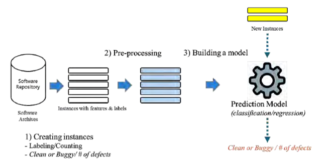
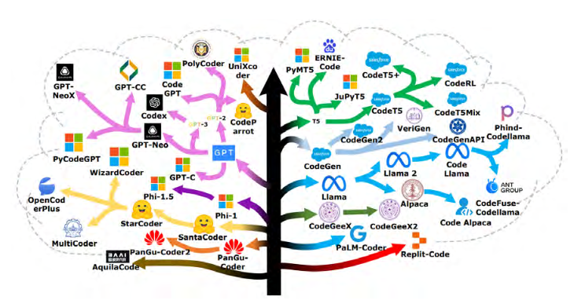
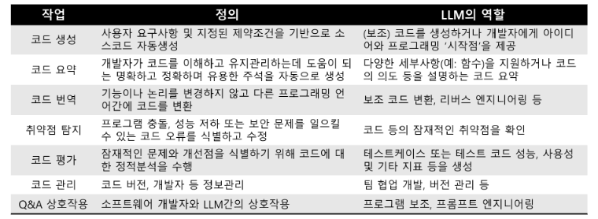

# 대규모 언어 모델을 이용한 소프트웨어 결함 예측

## 류덕산 | 전북대학교

### 최강훈

---

# 소프트웨어 결함 예측 (Software Defect Prediction, SDP)

- 소프트웨어 품질과 관련된 정량적 데이터를 분석하여, 결함이 발생할 가능성이 높은 소프트웨어 개체를 식별, 품질 보증 활동 (코드리뷰, 테스팅 등)이 집중되도록 가이드

---

# 소프트웨어 결함 예측의 정량적 데이터

- Code Metrics
  - 함수 내 분기문의 개수
  - 함수 내 조건문의 최대 중첩 깊이
  - 함수의 매개번수의 개수
- 결함 보고서
- 테스트 결과
- 개발자 간의 수신/발신 메시지
- Commit 내역

---

---

# SDP 기술의 진화

1. 전통적인 기계 학습
   - 로지스틱 회귀, SVM, 랜덤 포레스트
2. 딥 러닝
   - CNN, DNN, DBN, LSTM
3. 대규모 언어 모델(LLM)
   - CodeBERT, GraphCodeBERT, UniXCoder, CodeT5+

---

---

# 소프트웨어 공학에서의 LLM

- 코드 생성
- 테스트 케이스 생성
- 코드 요약
- 취약점 수정

---

---

# 소프트웨어 결함 예측과 LLM

1. 효과적인 결함 예측을 위한 프롬프트 엔지니어링
2. 추가 데이터 소스 및 맥락 활용
3. 매개변수 효율적 미세 조정 방법 탐구
4. 데이터 부족 시나리오를 위한 프롬프트 튜닝 적용
5. SDP의 구조화된 데이터에 대한 LLM 연구

---

# 미래 연구 방향

1. SDP를 위한 고급 프롬프트 엔지니어링
2. 다양한 데이터 소스 활용
3. 계산 비용 절감
4. 새로운 LLM 출력 응용 탐구
5. 데이터 부족 문제 해결
6. 구조화된 데이터에 적합한 LLM 개발

---

# 결론

- LLM은 SDP에서 유망한 결과를 보여줌
- 효과성과 효율성 향상을 위한 지속적인 연구
- 소프트웨어 품질 보증을 크게 향상시킬 잠재력
- 미래 연구 및 응용을 위한 흥미로운 기회

---

# 감사합니다!

질문이 있으신가요?
